

  

## Project Summary
This project demonstrates the deployment of the osTicket help desk system on a Windows virtual machine hosted in Microsoft Azure. The lab involved configuring a cloud-based Windows environment, enabling IIS web server features, installing PHP and MySQL dependencies, deploying the osTicket web application, creating the required database, and completing the browser-based installation process.

The purpose of this project was to gain hands-on experience with web application deployment, Windows-based web server configuration, database setup, and help desk platform installation in a cloud environment.

## Technologies Used
- Microsoft Azure
- Azure Virtual Machines
- Remote Desktop Protocol
- Internet Information Services (IIS)
- PHP Manager for IIS
- PHP
- MySQL
- HeidiSQL
- osTicket

## Environments Used
- Microsoft Azure
- Windows 10 Virtual Machine
- IIS Web Server
- MySQL Database Environment

## Languages / Components Used
- PHP
- SQL
- IIS / CGI
- MySQL Database

## Project Objectives
- Create a Windows virtual machine in Microsoft Azure
- Connect to the virtual machine using Remote Desktop
- Install and configure IIS with CGI support
- Install PHP Manager, PHP, URL Rewrite Module, and MySQL
- Deploy the osTicket application files into the IIS web directory
- Configure required PHP extensions
- Create a MySQL database for osTicket
- Complete the osTicket web-based installation
- Verify access to the end-user portal and admin/agent login page

## Implementation Steps

### Step 1: Create the Azure Virtual Machine
Created a Windows 10 virtual machine in Microsoft Azure to host the osTicket help desk system. This VM served as the web server and database host for the lab.

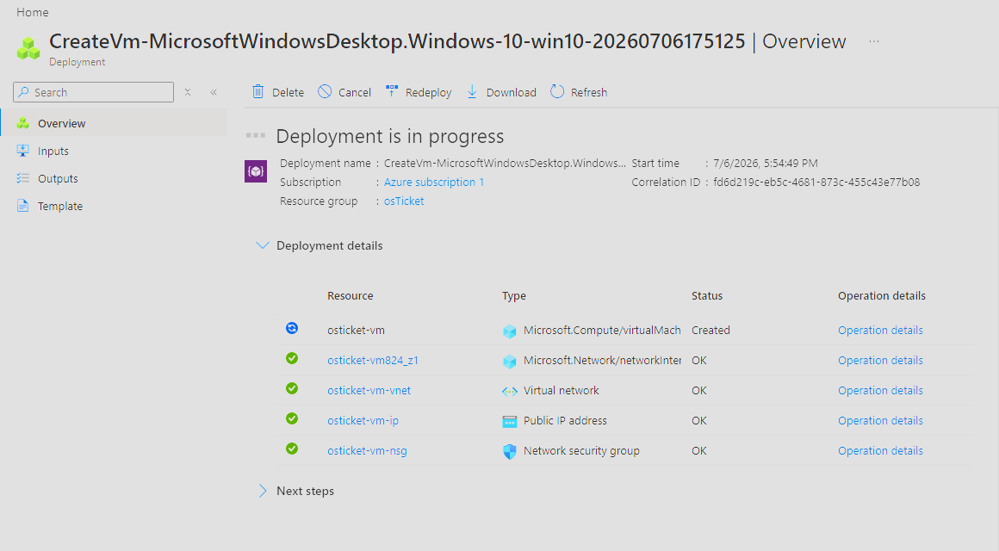

### Step 2: Connect to the VM Using Remote Desktop
Connected to the Azure virtual machine using Remote Desktop Protocol so the system could be configured directly.

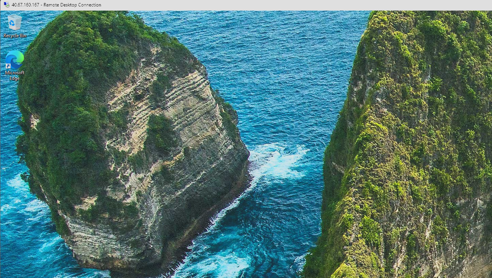

### Step 3: Download and Extract the osTicket Installation Files
Downloaded the osTicket installation files and extracted them on the virtual machine. These files included osTicket and several required dependencies used during setup.

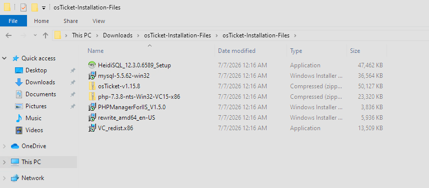

### Step 4: Install IIS and Enable CGI
Enabled Internet Information Services and the CGI feature in Windows. IIS was required to host the osTicket web application, and CGI support was needed for PHP functionality.

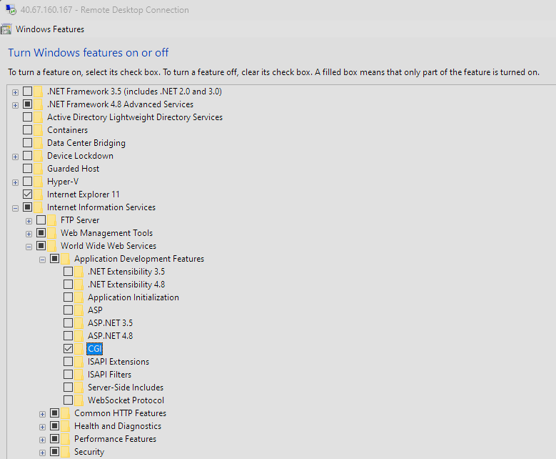

### Step 5: Install PHP Manager for IIS
Installed PHP Manager for IIS to make it easier to register and manage PHP within IIS.

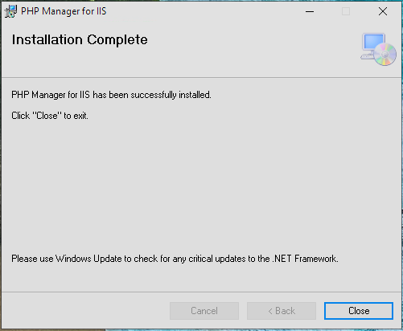

### Step 6: Install the URL Rewrite Module
Installed the IIS URL Rewrite Module, which is commonly required for web applications that rely on rewritten or cleaner URLs.

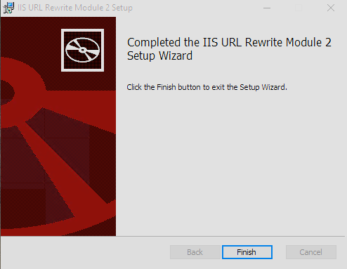

### Step 7: Create the PHP Directory and Extract PHP
Created the `C:\PHP` directory and extracted the PHP files into that folder. This prepared the system so PHP could be registered with IIS.

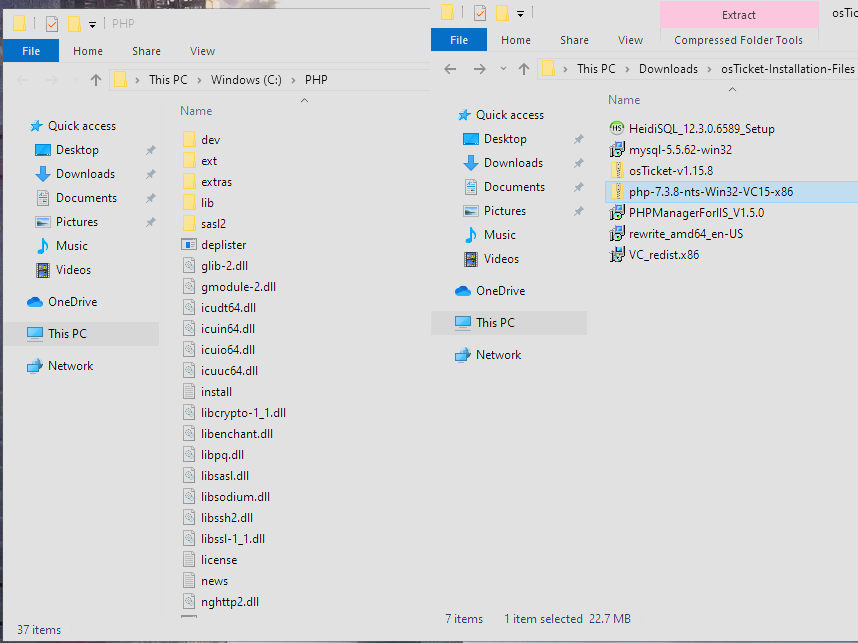

### Step 8: Install Required Runtime and Database Components
Installed the Visual C++ Redistributable and MySQL. MySQL was used as the database backend for osTicket.

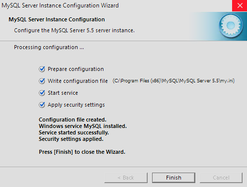

### Step 9: Register PHP in IIS
Opened IIS as administrator and registered PHP through PHP Manager by selecting the `php-cgi.exe` executable from the PHP directory. IIS was then restarted to apply the configuration changes.

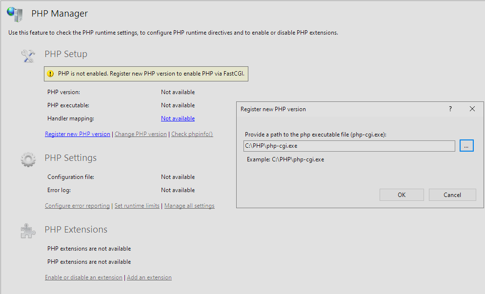

### Step 10: Deploy osTicket to the IIS Web Directory
Copied the osTicket upload folder into `C:\inetpub\wwwroot` and renamed it to `osTicket`. This made the application accessible through the local IIS web server.

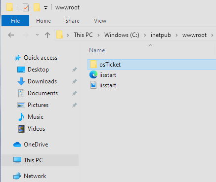

### Step 11: Enable Required PHP Extensions
Enabled required PHP extensions for osTicket, including IMAP, INTL, and OPcache. After enabling the extensions, the osTicket setup page was refreshed to verify the requirements were met.

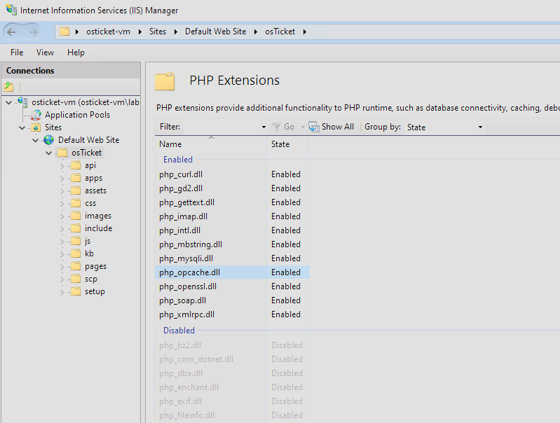

### Step 12: Rename the osTicket Configuration File & Assign Permissions
Renamed `ost-sampleconfig.php` to `ost-config.php` inside the osTicket include directory. This file is used by osTicket to store configuration settings. Then updated permissions on `ost-config.php` so the installer could write the necessary configuration data during setup.

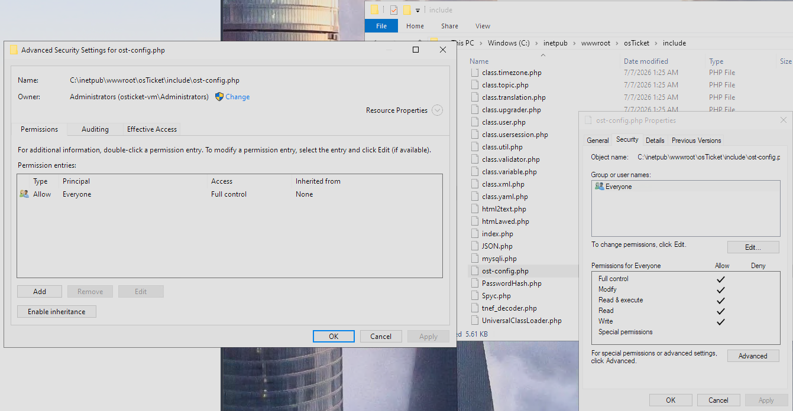

### Step 13: Create the osTicket Database
Opened HeidiSQL, connected to the local MySQL instance, and created a database for osTicket.

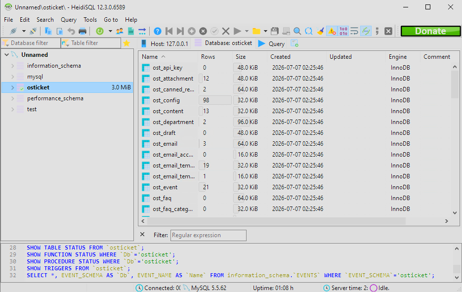

### Step 14: Complete the Browser-Based osTicket Installation
Completed the osTicket setup process in the browser by entering the required help desk and database information.

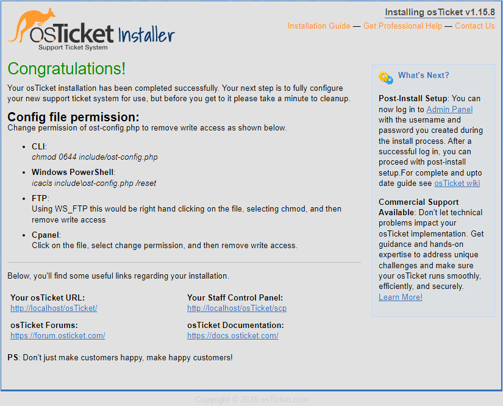

### Step 15: Verify Portal Access
Verified that both the end-user portal and the admin/agent login page were accessible.

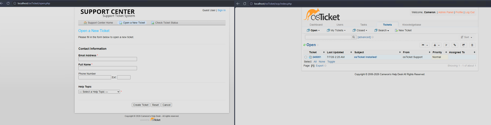

## Demonstration
The final osTicket deployment was verified by accessing:

- The end-user portal
- The admin/agent login page

This confirmed that IIS, PHP, MySQL, and osTicket were configured correctly and that the help desk web application was functioning.

## Skills Demonstrated
- Microsoft Azure virtual machine deployment
- Remote Desktop administration
- IIS web server configuration
- PHP installation and configuration
- MySQL database setup
- Web application deployment
- File permissions management
- Technical documentation

## Key Takeaways
This project helped me understand how web applications depend on multiple layers working together, including the operating system, web server, PHP runtime, database server, application files, permissions, and browser-based configuration. It also reinforced the importance of documenting each step clearly and securing configuration files after installation.
